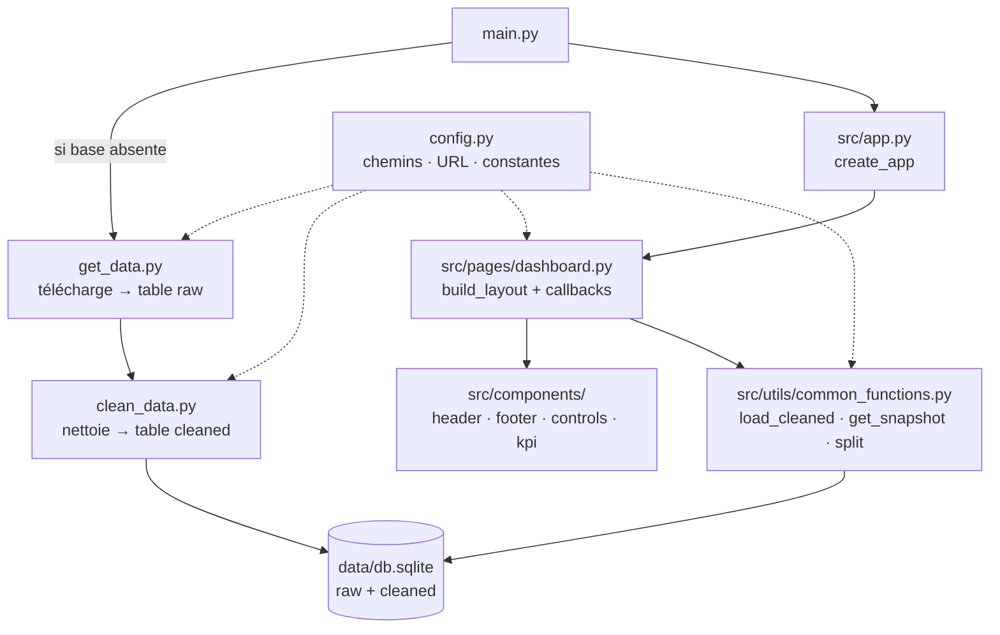

# COVID-19 — Dashboard Mondial

Dashboard interactif (Dash + Plotly) qui éclaire l'épidémie de COVID-19 à
partir des données ouvertes **Our World in Data**. Il propose des séries
temporelles, une carte mondiale géolocalisée, un histogramme de distribution
entre pays et un tableau de données.

> _Capture d'écran à ajouter dans `images/preview.png`._

---

## User Guide

### Prérequis

- [uv](https://docs.astral.sh/uv/) (gestion de l'environnement virtuel) ;
- Python ≥ 3.13 (installé automatiquement par uv au besoin).

### Déploiement sur une autre machine

```bash
git clone https://github.com/Spartaiis/proj.git data_project
cd data_project
uv sync                 # installe les dépendances dans .venv
uv run python main.py   # construit la base au 1er lancement, puis démarre
```

Ouvrir ensuite **http://127.0.0.1:8050** dans un navigateur web standard.

> **Premier lancement :** si la base `data/db.sqlite` est absente, `main.py` la
> construit automatiquement en téléchargeant les données puis en les nettoyant
> (`get_data.py` → `clean_data.py`). Une connexion Internet est alors requise
> *une seule fois* ; les lancements suivants fonctionnent hors-ligne.

### Utilisation

- **Pays sélectionnés** : choisir un ou plusieurs pays pour les séries
  temporelles.
- **Période** : restreindre la fenêtre temporelle (impacte tous les onglets).
- **Indicateur** : variable affichée par la carte et l'histogramme.
- **Onglets** : 📈 Séries temporelles · 🗺️ Carte mondiale · 📊 Histogramme ·
  📋 Données.

### Vidéo de démonstration

➡️ **Lien de la vidéo : _(à compléter)_** — une démonstration commentée de
3 minutes max présentant l'ensemble des fonctionnalités.

---

## Data

| | |
|---|---|
| **Source** | Our World in Data — *COVID-19, Cases and deaths* |
| **Pointeur** | <https://catalog.ourworldindata.org/garden/covid/latest/cases_deaths/cases_deaths.csv> |
| **Portail** | <https://ourworldindata.org/coronavirus> |
| **Licence** | Creative Commons BY 4.0 |
| **Format** | CSV statique (téléchargé par `get_data.py`) |

**Volumétrie :** ~558 000 observations (OBS), 233 pays + agrégats, couvrant la
période 2020-01-04 → 2026-02-22.

**Variables clés** (toutes numériques, non catégorielles) : `total_cases`,
`total_deaths`, `new_cases_per_million`, `new_deaths_per_million`,
`total_cases_per_million`, `total_deaths_per_million`.

**Conformité aux critères du jeu de données :**

- **OBS suffisant** : 233 pays → histogramme pertinent ;
- **variable non catégorielle** : décès/cas par million (relation d'ordre) ;
- **géolocalisation** : via le nom de pays (`locationmode="country names"`).

Les agrégats (`World`, `Europe`, `High-income countries`…) sont exclus des
pays réels via `config.REGIONS` ; la ligne `World` alimente les indicateurs
globaux (KPI).

---

## Developer Guide

### Architecture

Le code suit un style **impératif** : des fonctions documentées, appelées
depuis le programme principal et les callbacks Dash.



### Arborescence

```
proj/
├── config.py                 # paramètres : chemins, URL, constantes métier
├── main.py                   # point d'entrée (python main.py)
├── pyproject.toml            # dépendances (uv)
├── README.md
├── data/
│   ├── raw/                  # données brutes téléchargées (git-ignoré)
│   └── db.sqlite             # base SQLite (tables raw + cleaned, git-ignorée)
├── images/                   # captures pour le README
├── src/
│   ├── app.py                # création de l'app Dash
│   ├── components/           # header, footer, controls, kpi
│   ├── pages/
│   │   └── dashboard.py      # layout, figures et callbacks
│   └── utils/
│       ├── get_data.py       # récupération → table raw
│       ├── clean_data.py     # nettoyage → table cleaned
│       └── common_functions.py
└── tests/                    # tests unitaires (pytest)
```

### Base de données

`data/db.sqlite` contient deux tables :

- **`raw`** : données brutes, sans modification (écrites par `get_data.py`) ;
- **`cleaned`** : colonnes sélectionnées, dates typées, valeurs manquantes
  remplacées par 0 (écrites par `clean_data.py`).

Reconstruire la base manuellement :

```bash
uv run python -m src.utils.get_data     # remplit la table raw
uv run python -m src.utils.clean_data   # remplit la table cleaned
```

### Ajouter un graphique

1. Écrire une fonction `build_xxx(...) -> go.Figure` dans
   [`src/pages/dashboard.py`](src/pages/dashboard.py).
2. Ajouter un onglet dans `build_tabs()`.
3. Ajouter la branche correspondante dans `render_tab()`.

### Ajouter une page

Créer un module dans `src/pages/`, y définir `build_layout()` et ses
callbacks, puis l'importer/assembler depuis `src/app.py`.

### Tests

```bash
uv run pytest
```

---

## Rapport d'analyse

*(Chiffres arrêtés au 2026-02-22, dernière date du jeu de données.)*

- **Bilan mondial** : ~**779 millions** de cas confirmés et ~**7,1 millions**
  de décès cumulés (ligne agrégée `World`).
- **Mortalité très inégale entre pays** : la médiane des décès par million est
  de **≈ 889**, mais la moyenne grimpe à **≈ 1 276**, signe d'une distribution
  fortement asymétrique (quelques pays très touchés tirent la moyenne vers le
  haut) — ce que l'**histogramme** rend visible.
- **Pays les plus endeuillés** (décès / million) : Pérou (~6 600), Bulgarie
  (~5 680), Macédoine du Nord, Bosnie-Herzégovine et Hongrie (~5 000+),
  principalement en Europe de l'Est et en Amérique latine.
- **Taux de cas détectés ≠ mortalité** : les pays au plus fort taux de cas
  rapportés par million (Brunei, Chypre, Saint-Marin, Autriche, Corée du Sud)
  ne sont **pas** les plus meurtriers, ce qui reflète des différences de
  dépistage, de structure d'âge et de systèmes de santé.
- **Dynamique temporelle** : les **séries temporelles** font apparaître des
  vagues successives (variants), bien plus marquées sur les *nouveaux* cas par
  million que sur les cumuls, qui ne font que croître.

> Ces conclusions sont explorables interactivement : filtrer par période et par
> indicateur met en évidence l'évolution des vagues et les disparités
> géographiques.

---

## Copyright

Je déclare sur l'honneur que le code fourni a été produit par moi/nous-même, à
l'exception des lignes ci-dessous :

- **`src/pages/dashboard.py`** — `warnings.filterwarnings(...)` : neutralisation
  de `DeprecationWarning` (motif inspiré de la
  [documentation `warnings`](https://docs.python.org/3/library/warnings.html)).
  Syntaxe : `filterwarnings(action, message, category)` filtre les
  avertissements dont le message correspond au motif regex donné.
- **`src/utils/common_functions.py`**, **`get_data.py`**, **`clean_data.py`** —
  usage de `contextlib.closing(sqlite3.connect(...))` :
  [documentation `contextlib`](https://docs.python.org/3/library/contextlib.html#contextlib.closing),
  garantit la fermeture de la connexion en sortie du bloc `with`.

Toute ligne non déclarée ci-dessus est réputée être produite par l'auteur (ou
les auteurs) du projet.

### Recours à l'IA

Le projet a bénéficié d'une assistance par IA agentique (Claude Code) pour la
restructuration en packages, la mise en conformité avec la consigne et la
documentation. Les prompts structurants sont conservés à part.
